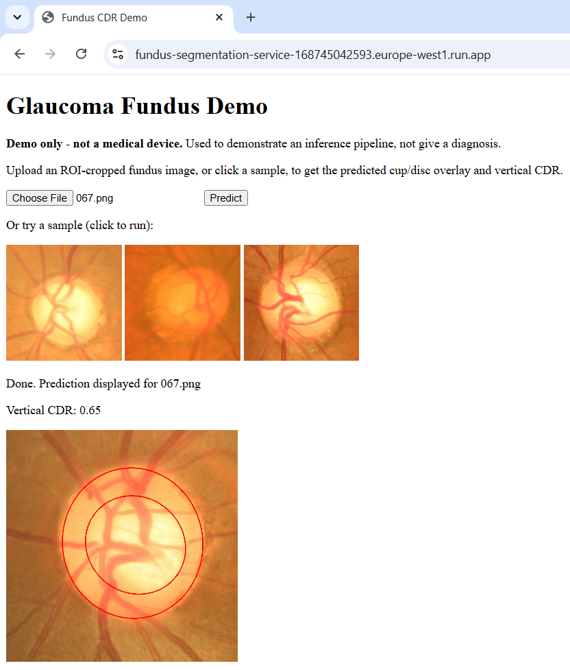

# Fundus Cup/Disc Segmentation Service

A hosted web service that runs the inference path of a glaucoma fundus-segmentation
model. Upload a retinal **fundus image** (cropped to the optic nerve head) and the
service returns the image with the **predicted optic cup and disc** drawn on it, plus
the predicted **vertical Cup-to-Disc Ratio (vCDR)**, a measurement used in glaucoma
assessment.


**Live demo:** https://fundus-segmentation-service-168745042593.europe-west1.run.app

> **First request after idle is slow (~20–30 s).** The service scales to zero when
> unused, so the first hit after an idle period pays a one-time cold start while the
> container boots and loads the models. Subsequent requests are fast (~1.4 s). See
> [Performance](#performance).


<p align="center">
  
  <br>
  <em>Screenshot of web demo with predicted disc (outer) and cup (inner) ellipses and vertical CDR.</em>
</p>


---

## What it does

> This repository is the **engineering / serving** side of the project: a FastAPI
> service, containerised with Docker, tested with pytest in CI, and deployed to
> Google Cloud Run. The **research side** (the training pipeline, the 5-channel
> preprocessing, the loss/metric design, and the architectural considerations behind
> the model) lives in a separate repository:
> **[glaucoma-fundus-segmentation](https://github.com/Pantelis-K/glaucoma-fundus-segmentation)**.


The service exposes a single prediction path. Given an already-ROI-cropped 640×640
fundus image containing the optic nerve head, it:

1. decodes the upload in memory and builds the model's 5-channel input
   (RGB + CLAHE + Sobel), resized to 256×256 and normalised to `[-1, 1]`;
2. runs two U-Net models - one for the **disc**, one for the **cup** - to produce
   segmentation masks;
3. fits ellipses to the masks, computes the **vertical CDR** (cup height ÷ disc
   height), and draws the predicted ellipses back onto the image;
4. returns the **vCDR** and the **overlay** (as a base64-encoded PNG) in a JSON
   response.

---

## Try it

**In the browser:** open the [live demo](https://fundus-segmentation-service-168745042593.europe-west1.run.app),
then either upload your own ROI-cropped fundus image or click one of the sample
crops to run them.

**From the command line:** from the repo root of a local clone (the sample crops live
in `samples/`):

```bash
curl -F "file=@samples/621.png" \
  https://fundus-segmentation-service-168745042593.europe-west1.run.app/predict
```

(On Windows PowerShell, use `curl.exe` so you get the real curl rather than the alias.)

The response looks like:

```json
{ "vertical_cdr": 0.73, "overlay_png": "<base64-encoded PNG>" }
```

Sample inputs ship in [`samples/`](samples) (IDs 621, 630, 634, 645, 648, 650  - 640×640 crops). As a
sanity check, 621 predicts a vCDR of roughly **0.73**.

---

## API

| Method & path        | Purpose                                                                 |
| -------------------- | ----------------------------------------------------------------------- |
| `GET /`              | The demo upload form (static HTML).                                      |
| `GET /health`        | Liveness check → `{"status": "ok"}`.                                     |
| `POST /predict`      | Multipart upload of a fundus image → `{vertical_cdr, overlay_png}` (200); **422** if the upload can't be read as an image, or if no disc/cup can be located in it. |
| `GET /samples/{file}`| The bundled sample crops, served as static files.                       |
| `GET /docs`          | Auto-generated Swagger UI (the developer view of the API).              |

Of the two 422 cases, the second is the subtle one: a decodable image that isn't a
valid fundus crop **may** fail ellipse fitting and be rejected - but it may equally
produce a confident, meaningless number instead. The 422 is not a guarantee that bad
input is caught. See [Limitations](#limitations).

---

## Architecture

```
  Browser (form + JS)  ─┐
                        ├─►  Cloud Run (public HTTPS, autoscale 0→3)
  curl / API client    ─┘          │
                                   ▼
                        FastAPI + Uvicorn container
                        ├─ two TensorFlow U-Net models (disc, cup)
                        │  loaded once at startup (FastAPI lifespan)
                        └─ model weights baked into the image at build time
                                   ▲
                                   |
                        Hugging Face Hub  ──  slim .keras weights
```

- **FastAPI / Uvicorn** serve the API; **Pydantic** defines and validates the
  response shape.
- **The two models are loaded once at startup**, via FastAPI's `lifespan`, and held in
  application state, never reloaded per request.
- **Weights are fetched from the [Hugging Face Hub](https://huggingface.co/Pantelis-K/glaucoma-fundus-unet)
  at image-build time**, so they're baked into the container rather than downloaded on
  the first request.
- The image is stored in **Google Artifact Registry** and run on **Cloud Run** in
  `europe-west1`.

**Model:** U-Net, input `(256, 256, 5)`, sigmoid output, ~34.5M parameters. Exported
with `compile=False` for serving (no optimizer state, no custom-object dependencies),
which slims each model to ~135 MB. Runs on TensorFlow 2.18.

---

## Design decisions

- **Honest input contract (ROI-cropped input).** The model was trained on images
  cropped to the optic nerve head using ground-truth disc annotations, which don't
  exist for arbitrary uploads. Rather than bolt on an unreliable automatic ROI
  detector (a separate ML project), the service asks for an already-cropped image and
  documents that contract plainly. See [Limitations](#limitations).
- **Stateless service.** No database, sessions, or stored uploads - each request is
  decoded in memory and answered independently. This is what makes scale-to-zero and
  horizontal autoscaling safe.
- **Load-once, not per-request.** Loading ~270 MB of weights and importing TensorFlow
  is expensive; doing it once at startup (not on every call) is the difference between
  a ~1.4 s warm response and an unusable one.
- **Fail clearly.** Invalid input is surfaced as a 422 with a human-readable reason,
  not a 500 or a silently wrong number.

---

## Performance

Measured on the deployed service (Cloud Run, `europe-west1`):

| Config            | Cold start (boot) | Warm `/predict` |
| ----------------- | ----------------- | --------------- |
| 1 vCPU / 2 GiB    | ~29 s             | ~9 s            |
| 2 vCPU / 2 GiB    | ~20 s             | ~6 s            |
| **4 vCPU / 2 GiB**| ~20–30 s          | **~1.4 s**      |

- **Warm requests (~1.4 s)** are what a visitor experiences after the first hit.
- **Cold start (~20–30 s, variable)** is paid once per idle period. It's dominated by
  pulling the image and loading ~270 MB of weights. This work is I/O-bound, and is
  why adding vCPUs speeds up inference but barely moves the boot time.
- The whole app sits behind FastAPI's `lifespan` startup, the container serves no route at all 
  until the models are loaded. So the cold start is principally a **page-load** wait, with no in-app 
  warning possible (the app can't render anything until startup finishes). The form's status
  line only covers the narrower case where an instance is reaped between page load and a prediction.
- **The vCPU finding:** warm latency dropped super-linearly from 2→4 vCPU (6 s → 1.4 s).
  TensorFlow sizes its thread pool to the host's core count rather than the container's
  CPU limit, so at low allocations it oversubscribes threads and contends.

**Cold-start mitigations considered and deliberately not applied:** setting
`min-instances=1` would eliminate the cold start but also end scale-to-zero and incur a
standing monthly cost. As this is only a demo I chose scale-to-zero plus transparent
documentation as the most appropriate design choice.

---

## Run it locally

Clone the repository and enter it first:

```bash
git clone https://github.com/Pantelis-K/fundus-segmentation-service.git
cd fundus-segmentation-service
```

### Option A — Docker (recommended)

The Dockerfile fetches the model weights from the Hugging Face Hub at build time, so no
manual weight download is needed.

```bash
docker build -t fundus-service .
docker run -p 8080:8080 fundus-service
# then open http://localhost:8080
```

### Option B — bare Python

```bash
python -m venv .venv
source .venv/bin/activate          # Windows: .venv\Scripts\activate
pip install -r requirements.txt

# fetch the slim weights from the Hugging Face Hub into the project root:
pip install huggingface_hub
python -c "from huggingface_hub import hf_hub_download; [hf_hub_download('Pantelis-K/glaucoma-fundus-unet', f, local_dir='.') for f in ('disc.keras','cup.keras')]"

uvicorn app:app --reload            # serves on http://127.0.0.1:8000
```

### Tests

```bash
pip install -r requirements-dev.txt
pytest
```

The endpoint tests stub out model loading and inference, so the suite runs fast on a
clean machine and doesn't need the weights, which is what runs in CI on every push.

---

## Limitations

**This is a demonstration of an inference pipeline, not a medical device. It must not
be used for diagnosis or any clinical decision.**

- **The model can't tell what it's been given.** It expects a 640×640 ROI-cropped
  fundus image, but it has no way to verify that the input actually is that. Feed it
  something else, like a larger or differently-sized image, or a photo that isn't a
  fundus at all, and the preprocessing will silently resize it and the model will still
  produce a vCDR and an overlay. The result will look confident and be meaningless. The
  422 path only catches cases where ellipse fitting fails outright; it does not catch a
  plausible-looking number computed from out-of-distribution input.
- **This was a deliberate scope choice.** Input-validation and out-of-distribution
  detection are real features that could mitigate this, but they were intentionally
  left out: the goal of this project is to demonstrate the **inference path** and its
  application with FastAPI, Docker, GCP, and CI - not to build a production-grade
  medical input pipeline.
- **Next planned feature:** a cheap guard that rejects any upload that isn't 640×640
  (the crop size the model was trained on), instead of silently resizing it. This only
  catches wrong-*size* inputs; detecting whether a correctly-sized image is actually a
  fundus is a harder, separate problem, left out of scope.

For how the model was trained and why it's built the way it is, see the research
repository:
**[glaucoma-fundus-segmentation](https://github.com/Pantelis-K/glaucoma-fundus-segmentation)**.

---

## Tech stack

FastAPI · Pydantic v2 · Uvicorn · TensorFlow 2.18 (Keras 3) · OpenCV (headless) ·
Docker · pytest · GitHub Actions · Google Cloud Run · Artifact Registry · Hugging Face Hub